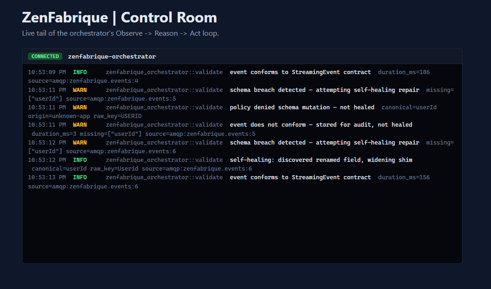

# ZenFabrique

### Autonomous Semantic Governance for Real-Time Streaming Data

**ZenFabrique** is a prototype nervous system for data. It moves away from static, manual ETL pipelines and towards an autonomous, self-healing architecture where metadata is active, governance is computational, and data sharing is zero-copy.

Built specifically for the music streaming domain, this project explores how a distributed system can detect, reason about, and automatically repair schema breaches without manual intervention.

---



---

## Requirements

ZenFabrique is being built as a Core MVP vertical slice first, with the Extended Architecture layered in later (see [docs/architecture/ARCHITECTURE_DECISIONS.md](docs/architecture/ARCHITECTURE_DECISIONS.md)). Install only what the track you're working on needs.

### Required to run the Core MVP (available today)

| Software | Version | Why it's needed |
| :--- | :--- | :--- |
| [Rust](https://www.rust-lang.org/tools/install) (rustup) | Stable, 1.75+ | Builds and runs the orchestrator (`cargo run`). |
| [Docker](https://docs.docker.com/get-docker/) + Docker Compose | 24+ | Runs Apache Jena/Fuseki locally (`docker-compose up -d jena`). |
| [DuckDB](https://duckdb.org/docs/installation/) | 0.10+ | Executes the generated shim SQL views. CLI is enough for manual inspection; the orchestrator links it via the `duckdb` Rust crate. |
| [Git](https://git-scm.com/downloads) | 2.x | Version control (this repo). |
| [Node.js](https://nodejs.org/) + npm | 20 LTS+ | Builds and runs the Svelte Control Room console (`ui/`). |

OPA and the FHE service (OpenFHE, via its Python bindings) are both live as of Phase 5 — no separate install needed, `docker-compose up -d opa fhe` covers both (the `fhe` service builds its own image from `privacy-plane/fhe/`).

### Additional requirements for the Extended Architecture (not needed yet)

Only install these once you're actually working on their corresponding roadmap phase — see [docs/planning/ROADMAP.md](docs/planning/ROADMAP.md).

| Software | Version | Why it's needed |
| :--- | :--- | :--- |
| [Trino](https://trino.io/download.html) | 440+ | Cross-source query federation. |
| Python 3.11+ | — | Required by [Dagster](https://docs.dagster.io/getting-started/install) for asset orchestration. |

---

## Technology Stack

ZenFabrique is built using a highly decoupled, state-of-the-art open-source stack to demonstrate advanced active metadata and zero-copy paradigms.

### Core Architectural Layers

| Layer | Technology | Primary Role in ZenFabrique |
| :--- | :--- | :--- |
| **Control Plane** | **Apache Jena (Fuseki) / Stardog** | RDF/OWL triple store and graph database hosting the semantic ontology model and executing SPARQL queries. |
| | **SHACL (Shapes Constraint)** | Explicit contract enforcement and constraint validation on streaming payloads to detect schema drift. |
| | **Protégé** | Direct visual modeling of the core music streaming domain entities and relationships. |
| **Data Plane** | **DuckDB (WASM / Native)** | Embedded, high-performance analytical engine for executing zero-copy query translations and dynamic runtime shims. |
| | **Trino** | Distributed SQL query federation engine enabling cross-source analysis without physical data egress. |
| | **Apache Parquet / Delta Lake** | Columnar, version-controlled storage format serving as the underlying data layer. |
| **Policy Plane** | **Open Policy Agent (OPA)** | Policy-as-Code engine using **Rego** to evaluate zero-trust data access, governance, and schema mutation privileges. |
| **Orchestration** | **Rust** | System-level, low-latency agent managing the core event-loop, intercepting schema failures, and spawning self-healing tasks. |
| | **Dagster** | Asset-first orchestrator managing state-aware data workflows, lineage tracking, and job execution. |

### Diagnostic "Control Room" Frontend

* **Svelte:** Light-weight, high-reactivity framework for the UI state. **Live today** as a terminal-style console (`ui/`).
* **WebSockets:** Bidirectional communication channel pulling active telemetry and validation logs directly from the Rust orchestrator. **Live today** — see `orchestrator/src/telemetry.rs`.
* **Cytoscape.js:** Graph theory and visualization library used to map the real-time topology of the active ontology and visible shim adaptors. **Not yet implemented** — Phase 6 was deliberately scoped console-first; the graph view is the next increment.

### Advanced Cryptography

* **FHE / SMPC Libraries:** (e.g., *OpenFHE* or *Concrete*) Used to implement privacy-preserving math over encrypted user streaming metrics, preventing raw PII leakage to downstream analytics tools.

---

## Architecture Overview

ZenFabrique is a three-plane architecture — a Control Plane ("Brain") that stores the ontology and validates events against SHACL shapes, a Data Plane ("Muscle") that executes zero-copy analytics and generates DuckDB shims when schemas drift, and a Policy Plane ("Conscience") that gates schema evolution and PII access via OPA/Rego. See [docs/architecture/ARCHITECTURE_OVERVIEW.md](docs/architecture/ARCHITECTURE_OVERVIEW.md) for the full breakdown of each plane's role, tech, and function.

---

## The "Self-Healing" Workflow

The fabric operates on an **Observe -> Reason -> Act** loop:

1.  **Observe:** Incoming streaming events (e.g., "Song Played") are captured.
2.  **Reason:** The system validates the event against the SHACL shape defined in the Knowledge Graph. If the structure is unrecognized (e.g., an unannounced schema change by the Producer service), the system triggers a "breakage" event.
3.  **Act:**
    * The **Rust-based Orchestrator** detects the breach.
    * It queries the Ontology to find the current valid shape.
    * It triggers an autonomous transformation that generates a temporary DuckDB SQL mapping (the "Shim") to normalize the event.
    * The Fabric updates the **GraphQL Federation** schema to allow downstream consumers (e.g., Royalties Engine) to continue receiving consistent data.

---

## Privacy-Preserving Analytics (FHE)
The fabric integrates Privacy-as-Code. User listening history is sensitive PII. Using Homomorphic Encryption (FHE) techniques, the system allows the Analytics Engine to calculate aggregate metrics (e.g., "Total Plays per Artist") across encrypted data. The data is only decrypted at the final output gate, ensuring full compliance without sacrificing analytical utility.

---

## The "Control Room" Dashboard
Unlike standard administrative panels, the **ZenFabrique UI** serves as a diagnostic dashboard for the system's "nervous system."

* **Observability Stream:** Real-time logging of schema evolution and autonomous repairs — a terminal-style console fed by a WebSocket straight from the orchestrator's own tracing output. **Live today.**
* **Topology Graph:** Visualizes the Knowledge Graph (using Cytoscape.js) to show current connections and "shim" nodes. **Not yet implemented** — deliberately deferred until the console above is fully working end-to-end (see STATUS.md).
* **Policy Gate:** A toggle interface for OPA policies, allowing you to simulate "Zero-Trust" enforcement and observe the system rejecting unauthorized data changes in real-time. **Not yet implemented** — today the console already surfaces policy allow/deny decisions as they happen; a dedicated toggle UI is future work.

---

## Getting Started

> **Status:** The Thin Vertical Slice (Phases 1-3), the Phase 4 transport swap, Phase 5 (OPA policy gate + FHE-encrypted aggregation), and the Phase 6 console are all done — see [docs/planning/STATUS.md](docs/planning/STATUS.md) for live progress and [docs/architecture/ARCHITECTURE_DECISIONS.md](docs/architecture/ARCHITECTURE_DECISIONS.md) for the Core vs. Extended stack split. The instructions below reflect what's actually running today; the remaining Extended Architecture steps (the Phase 6 Cytoscape graph, Phase 7) describe the target end-state and are not yet implemented.

### Running it today
Proves the Observe -> Reason -> Act loop end-to-end over a real message broker, with schema mutations gated by policy and usage metrics protected by FHE. See [Requirements](#requirements) above for what to install first.

1.  **Bring up the Control Plane, transport, policy, and privacy services:** `docker-compose up -d jena rabbitmq opa fhe`. The custom Fuseki assembler config (`config/fuseki/zenfabrique.ttl`) creates the `zenfabrique` dataset automatically on first boot; OPA mounts `policy-plane/rego/` directly (no manual policy load); `fhe` builds its own image from `privacy-plane/fhe/` on first run (a few seconds). RabbitMQ's management UI is at `http://localhost:15672` (guest/guest, local dev only).
2.  **Seed events:** `config/fabric.yaml` defaults to `ingestion.backend: rabbitmq`, so publish JSON events onto the `zenfabrique.events` queue, e.g. via `rabbitmqadmin` inside the container:
    ```bash
    docker exec zenfabrique-rabbitmq rabbitmqadmin publish message \
      --routing-key zenfabrique.events \
      --payload '{"eventId":"evt-1","userId":"u1","trackId":"t1","timestamp":"2026-01-01T00:00:00","msPlayed":1000}'
    ```
    For local dev without a broker running, set `ingestion.backend: file_watch` in `config/fabric.yaml` instead and drop JSON files into `events/input/` — both backends feed the exact same downstream loop.
3.  **Spin up the Nervous System:** run the Rust orchestrator from the repo root:
    ```bash
    cargo run --manifest-path orchestrator/Cargo.toml --release -- --config ./config/fabric.yaml
    ```
4.  **Observe repair:** malformed events trigger an automatic DuckDB shim (schema mutations are checked against `policy-plane/rego/schema_mutation.rego` first); check the orchestrator logs (each event logs a `duration_ms`) and query the resulting `streaming_events` view in `data-plane/zenfabrique.duckdb` with the `duckdb` CLI.
5.  **Query an encrypted aggregate:** `msPlayed` is encrypted via the `fhe` service at ingest and stored as ciphertext in the `encrypted_metrics` table — never in the clear. Sum a user's listening time without decrypting any individual event:
    ```bash
    cargo run --manifest-path orchestrator/Cargo.toml --release -- --config ./config/fabric.yaml --aggregate-user u1
    ```
6.  **Watch it live in the Control Room console:** `config/fabric.yaml`'s `telemetry` section is on by default, so the orchestrator already starts a WebSocket feed at `127.0.0.1:9001` (comment out that section to run without it — nothing downstream depends on it). Then:
    ```bash
    cd ui && npm install && npm run dev
    ```
    Open the printed `localhost` URL — every schema breach, policy decision, and repair shows up as a color-coded line the moment it happens, mirroring the orchestrator's own terminal output.

### Extended Architecture (target state, not yet implemented)
Everything below is planned but deferred until it's actually needed — see [docs/planning/ROADMAP.md](docs/planning/ROADMAP.md) Phases 6-7.

* **Control Room topology graph (Phase 6):** Cytoscape.js visualization of the Knowledge Graph and shim nodes — deliberately deferred until the console above had full test coverage end-to-end.
* **Federation & Hardening (Phase 7):** Add Trino for cross-source query federation; Dagster for asset-aware orchestration; stress testing and latency tuning.

---

## Future Layering
This architecture is modular by design. Future roadmap includes:
* **Federated GraphQL:** To allow unified querying across external data sources.
* **Advanced Logic Reasoning:** Implementing fully automated ontology expansion based on emerging data patterns.
* **Hardened Privacy:** Expanding FHE support to include cross-service SMPC (Secure Multi-Party Computation).

---

*This project is a personal exploration into high-scale, autonomous data systems.*